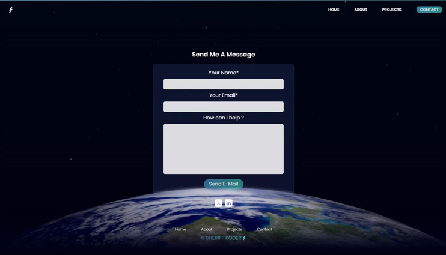
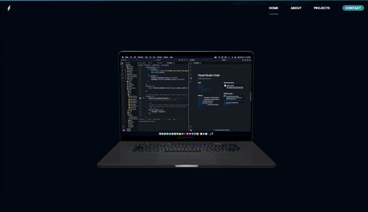

## ****Three.js Portfolio** [[ Live Demo ]](https://www.sheriffkoder.com/)**

>## **Description**

A static website built with Next.js, Tailwind CSS.
Used Three.js to add 3D Models to be displayed on pages and animate them with javascript.

>## **How to use on your computer**
- Clone or download the project folder
- open the folder in your IDE
- open the terminal and run "npm install"
- run "npm run dev" in the terminal after the installation is complete
- create a ".env" file in the root directory and add these keys

>######  EmailHost = "amazon aws email API domain"
>###### EmailPort = "port number"
>###### EmailUser = "credentials key"
>###### EmailPass = "credentials password"
>###### myEmail = "a email to send to"